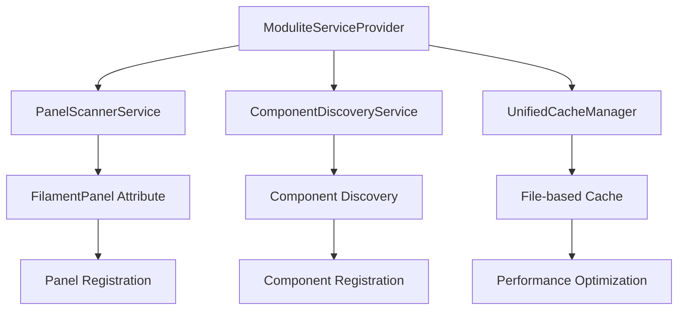

# 📚 Modulite Documentation

Welcome to the comprehensive documentation for Modulite - the automatic Filament Panel Provider discovery package for modular Laravel applications.

## 🚀 Quick Links

- **[Main README](../README.md)** - Overview and quick start
- **[Installation Guide](INSTALLATION.md)** - Complete setup instructions
- **[Configuration Guide](CONFIGURATION.md)** - All configuration options
- **[Usage Examples](EXAMPLES.md)** - Real-world examples and patterns
- **[API Reference](API_REFERENCE.md)** - Complete API documentation
- **[Troubleshooting](TROUBLESHOOTING.md)** - Common issues and solutions
- **[Contributing](../CONTRIBUTING.md)** - How to contribute
- **[Changelog](../CHANGELOG.md)** - Version history

## 📖 Documentation Overview

### Getting Started

1. **[Installation Guide](INSTALLATION.md)**
   - System requirements
   - Step-by-step installation
   - Environment configuration
   - First panel creation
   - Verification and testing

2. **[Configuration Guide](CONFIGURATION.md)**
   - Panel discovery configuration
   - Component discovery settings
   - Cache configuration
   - Performance optimization
   - Environment-specific settings

### Usage & Examples

3. **[Usage Examples](EXAMPLES.md)**
   - Basic panel setup
   - Multi-panel applications
   - Component organization
   - Advanced configurations
   - Enterprise patterns
   - Performance optimization
   - Testing strategies
   - Deployment examples

### Reference

4. **[API Reference](API_REFERENCE.md)**
   - Attributes (`#[FilamentPanel]`)
   - Interfaces (`CacheManagerInterface`, `PanelScannerInterface`)
   - Services (`UnifiedCacheManager`, `PanelScannerService`)
   - Console commands
   - Exceptions
   - Configuration schema
   - Helper functions

### Support

5. **[Troubleshooting](TROUBLESHOOTING.md)**
   - Quick diagnostic commands
   - Common issues and solutions
   - Cache troubleshooting
   - Panel discovery issues
   - Performance problems
   - Environment-specific issues
   - Advanced debugging
   - FAQ

## 🎯 Documentation by Use Case

### I'm New to Modulite
Start with the [Main README](../README.md) for an overview, then follow the [Installation Guide](INSTALLATION.md).

### I Want to Set Up My First Panel
1. [Installation Guide](INSTALLATION.md) - Install and configure
2. [Usage Examples](EXAMPLES.md#basic-panel-setup) - Create your first panel
3. [Troubleshooting](TROUBLESHOOTING.md) - If you run into issues

### I Need to Configure for Production
1. [Configuration Guide](CONFIGURATION.md#production-optimizations) - Production settings
2. [Usage Examples](EXAMPLES.md#performance-optimization) - Performance patterns
3. [Installation Guide](INSTALLATION.md#environment-configuration) - Environment setup

### I'm Building a Multi-Panel Application
1. [Usage Examples](EXAMPLES.md#multi-panel-applications) - Multi-panel patterns
2. [Configuration Guide](CONFIGURATION.md#panel-discovery-configuration) - Panel configuration
3. [API Reference](API_REFERENCE.md#filamentpanel) - Attribute options

### I'm Working with Components
1. [Configuration Guide](CONFIGURATION.md#component-discovery-configuration) - Component setup
2. [Usage Examples](EXAMPLES.md#component-organization) - Organization patterns
3. [API Reference](API_REFERENCE.md#componentdiscoveryservice) - Component API

### I Need to Debug Issues
1. [Troubleshooting](TROUBLESHOOTING.md) - Common solutions
2. [API Reference](API_REFERENCE.md#console-commands) - Debug commands
3. [Configuration Guide](CONFIGURATION.md#logging--debugging) - Logging setup

### I Want to Contribute
1. [Contributing Guide](../CONTRIBUTING.md) - How to contribute
2. [API Reference](API_REFERENCE.md) - Code structure
3. [Changelog](../CHANGELOG.md) - Recent changes

## 🏗️ Architecture Overview

### Core Components



### Key Features

- **🔍 Auto-Discovery**: Automatically finds and registers Filament panels
- **⚡ Performance**: Multi-layer caching with production optimizations
- **🏗️ Modular**: Built for nwidart/laravel-modules and modular applications
- **🎯 Attribute-Based**: Clean registration with `#[FilamentPanel]` attribute
- **📊 Component Discovery**: Auto-discover Resources, Pages, and Widgets
- **🛡️ Production Ready**: Robust error handling and enterprise features

### Integration Points

- **Laravel Service Container**: Proper dependency injection
- **Filament Panel System**: Seamless panel registration
- **nwidart/laravel-modules**: Module system integration
- **Laravel Cache**: Intelligent caching strategies
- **Artisan Commands**: Development and debugging tools

## 📝 Code Examples

### Basic Usage

```php
<?php

namespace Modules\Admin\Providers\Filament\Panels;

use Filament\Panel;
use Filament\PanelProvider;
use PanicDevs\Modulite\Attributes\FilamentPanel;

#[FilamentPanel]
class AdminPanelProvider extends PanelProvider
{
    public function panel(Panel $panel): Panel
    {
        return $panel
            ->default()
            ->id('admin')
            ->path('/admin')
            ->login();
    }
}
```

### Advanced Configuration

```php
#[FilamentPanel(
    priority: 100,
    environment: 'production',
    autoRegister: true
)]
class ProductionPanelProvider extends PanelProvider
{
    // Panel implementation
}
```

### Service Usage

```php
use PanicDevs\Modulite\Contracts\PanelScannerInterface;

$scanner = app(PanelScannerInterface::class);
$panels = $scanner->discoverPanels();

foreach ($panels as $panelClass) {
    app()->register($panelClass);
}
```

## 🔧 Development Tools

### Console Commands

```bash
# Check Modulite status
php artisan modulite:status

# Clear cache
php artisan modulite:clear-cache

# Benchmark performance
php artisan modulite:benchmark

# Discover panels manually
php artisan modulite:discover-panels --verbose

# Discover components
php artisan modulite:discover-components admin
```

### Configuration

```php
// config/modulite.php
return [
    'panels' => [
        'locations' => ['modules/*/Providers/Filament/Panels'],
        'patterns' => ['*PanelProvider.php'],
    ],
    'cache' => [
        'enabled' => true,
        'ttl' => 0, // Never expires in production
    ],
    'performance' => [
        'lazy_discovery' => true,
    ],
];
```

## 🌍 Environment Support

### Development
- Auto-invalidation on file changes
- Detailed logging and debugging
- Hot reloading support

### Staging
- Balanced performance and debugging
- Configurable cache TTL
- Error logging without breaking execution

### Production
- Maximum performance optimization
- Persistent caching (TTL=0)
- Silent error handling
- Minimal logging overhead

## 📊 Performance

### Benchmarks (Production Environment)

**Cached Operations:**
- **Cache Read**: 0ms average
- **Panel Discovery**: 0ms average (fully cached)
- **Component Discovery**: 0ms average

**Cache Simulation (500 iterations):**
- **Panel Discovery**: 1.054ms average
- **Performance**: Sub-millisecond for all cached operations

### Optimization Features

- **Lazy Discovery**: Defer scanning until needed
- **Multi-layer Caching**: File + memory caching
- **Memory Management**: Batch processing for large codebases
- **OPcache Compatible**: Works with PHP OPcache
- **Production Optimized**: Zero-overhead in production

## 🤝 Community & Support

### Getting Help

- **🐛 Bug Reports**: [GitHub Issues](https://github.com/panicdevs/modulite/issues)
- **💬 Discussions**: [GitHub Discussions](https://github.com/panicdevs/modulite/discussions)
- **📧 Email**: [support@panicdevs.agency](mailto:support@panicdevs.agency)
- **💰 Sponsor**: [GitHub Sponsors](https://github.com/sponsors/panicdevs)

### Contributing

We welcome contributions! See our [Contributing Guide](../CONTRIBUTING.md) for:

- Code of conduct
- Development setup
- Pull request process
- Issue guidelines
- Testing requirements

### Recognition

- All contributors are recognized in our [README](../README.md)
- Major contributors highlighted in release notes
- Community contributors featured in documentation

## 📜 License

Modulite is open-sourced software licensed under the [MIT license](../LICENSE).

---

**Built with ❤️ by [PanicDevs](https://panicdevs.agency)**

For questions about this documentation, please [open an issue](https://github.com/panicdevs/modulite/issues) or contact us at [docs@panicdevs.agency](mailto:docs@panicdevs.agency).
